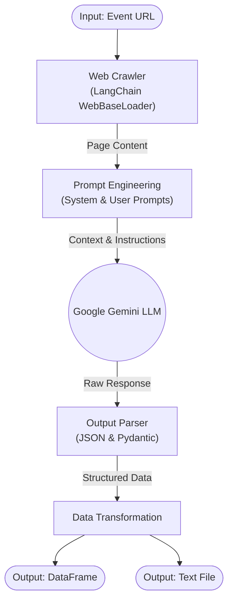

# Agenda Speech Generator

> [!NOTE]
> 🚧 **Work in Progress**: This project is currently under active development. Features and interfaces are subject to change.


**Agenda Speech Generator** is an automated tool designed to generate professional Master of Ceremonies (MC) scripts for events. By crawling event agenda webpages and leveraging the power of Large Language Models (LLM), specifically Google Gemini, it creates tailored speeches for every session of your event.

## 📖 Table of Contents

- [Features](#-features)
- [Project Structure](#-project-structure)
- [Tech Stack](#-tech-stack)
- [Getting Started](#-getting-started)
  - [Prerequisites](#prerequisites)
  - [Installation](#installation)
  - [Configuration](#configuration)
- [Usage](#-usage)
- [Contributing](#-contributing)

## ✨ Features

- **Automated Web Crawling**: Extracts event agendas, time slots, and speaker information directly from event websites using `LangChain`'s web loaders.
- **AI-Powered Script Generation**: Utilizes **Google Gemini** models to generate professional MC scripts based on **structured prompt instructions**.
- **Customizable Tone**: Capable of adjusting the speech style based on the event type (e.g., formal for seminars, lively for commercial events).
- **Structured Output**: Generates results in JSON format, converts them to Pandas DataFrames, and converts the final output to a text file.
- **Token Usage Tracking**: Monitors input and output tokens for cost and performance management.

## 🔄 Workflow



## 📂 Project Structure

```
Agenda-Speech-Generator/
├── code/
│   ├── mod/
│   │   ├── A_LLM.py       # Core LLM interaction, web loading, and prompt management
│   │   ├── B_text.py      # Text transformation and file saving utilities
│   │   └── O_prompt.py    # System and User prompt templates
│   └── crawl.ipynb        # Main Jupyter Notebook for execution
├── .env                   # Environment variables (API Keys)
├── .gitignore             # Git ignore rules
└── README.md              # Project documentation
```

## 🛠 Tech Stack

- **Language**: Python 3.13+
- **LLM Framework**: [LangChain](https://www.langchain.com/)
- **Model Provider**: Google Gemini (`gemini-3-flash-preview`)
- **Data Manipulation**: Pandas
- **Environment Management**: python-dotenv

## 🚀 Getting Started

Follow these steps to set up and run the project locally.

### Prerequisites

- Python 3.10 or higher
- A Google Cloud API Key with access to Gemini models.

### Installation

1. **Clone the repository**
   ```bash
   git clone https://github.com/your-username/Agenda-Speech-Generator.git
   cd Agenda-Speech-Generator
   ```

2. **Install dependencies**
   Ensure you have the required packages installed. You can install them via pip:
   ```bash
   pip install langchain langchain-community langchain-google-genai pandas python-dotenv notebook beautifulsoup4
   ```
   *Note: If you are using Poetry, simply run `poetry install`.*

### Configuration

1. Create a `.env` file in the root directory.
2. Add your Google API key and User Agent string:

   ```inf
   GOOGLE_API=your_google_api_key_here
   USER_AGENT=your_user_agent_string
   ```

## 💡 Usage

The project is designed to be run via a Jupyter Notebook.

1. **Open the Notebook**
   Launch Jupyter Notebook or JupyterLab and open `code/crawl.ipynb`.

2. **Set Target URL**
   In the notebook, modify the `url` variable to point to your target event agenda page.
   > **Note**: The target webpage **must** contain a clear event agenda for the crawler to extract.
   ```python
   url = "https://www.digitimes.com.tw/seminar/NTTDATA_20251212/"
   ```

3. **Run Cells**
   Execute the cells sequentially to:
   - Load web content.
   - Connect to the LLM.
   - Generate the script.
   - View the output DataFrame.
   - Save the final script to a text file.

4. **Output**
   The generated speech script will be displayed in the notebook and saved to the specified path (default: `data/text.txt`, ensure the directory exists or update the path in the notebook).

## 🗺️ Roadmap

- [ ] **User Interface (UI)**: Develop a user-friendly graphical interface for easier interaction.
- [ ] **Hugging Face Deployment**: Deploy the application to Hugging Face Spaces for public access.
- [ ] **Model Optimization**: Fine-tune prompt engineering for better speech quality.

## 🤝 Contributing

Contributions are welcome! Please feel free to submit a Pull Request.

1. Fork the project
2. Create your feature branch (`git checkout -b feature/AmazingFeature`)
3. Commit your changes (`git commit -m 'Add some AmazingFeature'`)
4. Push to the branch (`git push origin feature/AmazingFeature`)
5. Open a Pull Request

---

*This project was generated for educational and productivity purposes.*