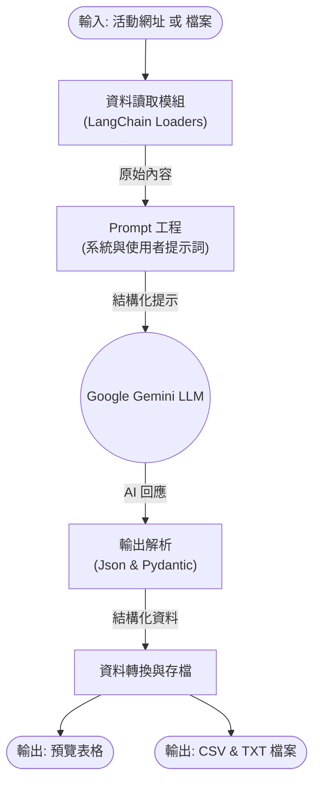

# Agenda Speech Generator (活動議程司儀稿生成器)

> [!TIP]
> 🟢 **線上試用**：本專案已部署至 Hugging Face Spaces，歡迎直接體驗：[**Agenda Speech Generator Demo**](https://huggingface.co/spaces/bevisrefiner/Agenda-Speech-Generator)


**Agenda Speech Generator** 是一個自動化工具，旨在為各類活動生成專業的司儀（MC）講稿。透過爬取活動議程網頁或分析上傳的議程檔案，並結合 Google Gemini 大型語言模型（LLM）的強大能力，它能為您快速產出包含開場、串場介紹與結尾的完整活動講稿。

## 📖 目錄

- [✨ 功能特色](#-功能特色)
- [🔄 運作流程](#-運作流程)
- [📂 專案架構](#-專案架構)
- [🛠 技術棧](#-技術棧)
- [🚀 快速開始](#-快速開始)
  - [前置需求](#前置需求)
  - [安裝教學](#安裝教學)
  - [設定環境](#設定環境)
- [💡 使用說明](#-使用說明)

## ✨ 功能特色

- **多源資料讀取**：
    - **網頁爬蟲**：直接輸入活動網址，自動擷取議程資訊（使用 LangChain WebBaseLoader）。
    - **多格式支援**：支援上傳 PDF, CSV, Excel, Word, Markdown, Text 等格式的議程檔案。
- **AI 智能生成**：
    - 核心採用 **Google Gemini** 模型（`gemini-3-flash-preview`），具備長文本理解與高生成品質。
    - 透過精心設計的 **Prompt Engineering**，確保產出的講稿專業且符合活動情境。
- **風格客製化**：
    - 系統會根據活動性質自動調整語氣（例如：研討會偏向專業正式，商業活動則較活潑）。
- **結構化輸出**：
    - 自動解析並整理講者職稱、姓名與演講主題。
    - 提供 **CSV** 與 **TXT** 兩種格式下載，方便後續編輯與使用。
- **透明化資訊**：
    - 介面即時顯示 Token 使用量與處理狀態，讓您掌握 API 使用成本。

## 🔄 運作流程


```mermaid
flowchart TD
    %% Nodes
    Input(["輸入: 活動網址 或 檔案"])
    Loader["資料讀取模組<br/>(LangChain Loaders)"]
    PromptEngine["Prompt 工程<br/>(系統與使用者提示詞)"]
    LLM(("Google Gemini LLM"))
    Parser["輸出解析<br/>(Json & Pydantic)"]
    DataProcess["資料轉換與存檔"]
    OutputDF(["輸出: 預覽表格"])
    OutputFiles(["輸出: CSV & TXT 檔案"])

    %% Edge
    Input --> Loader
    Loader -->|原始內容| PromptEngine
    PromptEngine -->|結構化提示| LLM
    LLM -->|AI 回應| Parser
    Parser -->|結構化資料| DataProcess
    DataProcess --> OutputDF
    DataProcess --> OutputFiles
```

## 📂 專案架構

```
Agenda-Speech-Generator/
├── app.py                 # Gradio 應用程式主入口 (Main Entry Point)
├── requirements.txt       # 專案依賴套件清單
├── .env                   # 環境變數設定檔 (需自行建立)
├── src/
│   └── mod/
│       ├── A_LLM.py       # 核心模組：LLM 連線、檔案讀取、Prompt 組裝
│       ├── B_text.py      # 工具模組：資料轉檔 (DataFrame/Text) 與存檔功能
│       └── O_prompt.py    # 定義 System Prompt 與 User Prompt 模板
└── README.md              # 專案說明文件
```

## 🛠 技術棧

- **程式語言**: Python 3.10+
- **網頁框架**: [Gradio](https://www.gradio.app/) (快速建置 AI web app)
- **LLM 框架**: [LangChain](https://www.langchain.com/)
- **AI 模型**: Google Gemini (`gemini-3-flash-preview`)
- **資料處理**: Pandas, Pydantic
- **環境管理**: python-dotenv

## 🚀 快速開始

請依照以下步驟在本地端執行本專案。

### 前置需求

- Python 3.10 或更高版本
- Google Cloud API Key (需開通 Gemini 模型存取權限)

### 安裝教學

1. **複製專案 (Clone Repository)**
   ```bash
   git clone https://github.com/your-username/Agenda-Speech-Generator.git
   cd Agenda-Speech-Generator
   ```

2. **安裝依賴套件 (Install Dependencies)**
   建議使用虛擬環境 (Virtual Environment)。
   ```bash
   pip install -r requirements.txt
   ```

### 設定環境

1. 在專案根目錄建立一個 `.env` 檔案。
2. 填入您的 API Key 與 User Agent 設定：

   ```inf
   GOOGLE_API=your_google_api_key_here
   USER_AGENT=my-app-user-agent
   ```

## 💡 使用說明

1. **啟動應用程式**
   在終端機執行：
   ```bash
   python app.py
   ```

2. **操作介面**
   - 程式啟動後，會顯示本地訪問網址 (通常為 `http://127.0.0.1:7860`)。
   - **Web URL 分頁**：輸入活動網址，點擊「開始生成」。
   - **File Upload 分頁**：上傳議程檔案 (PDF/Excel/Word等)，點擊「開始生成」。

3. **取得結果**
   - 介面將顯示議程表預覽。
   - 您可以點擊按鈕下載生成的 `.csv` 表格或 `.txt` 講稿文字檔。

---

*本專案僅供教育與學術研究用途。*